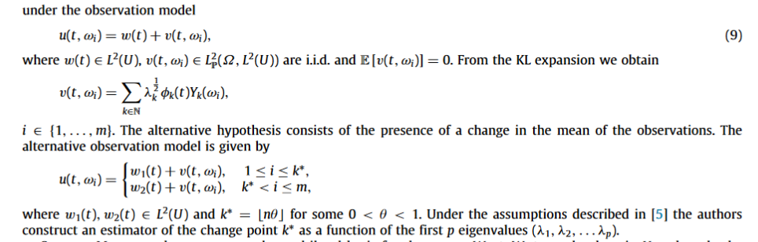

class: inverse, middle

# Outline

* My background

  * Research, Interests & Philosophy, Mathematics Background

* Motivation: Why Functional Data Analysis?

  * Relationship with big data
  * Possible opportunities
  
* What can we bring to the table? or, some possible directions

  * Case study: Comparing anomaly detection / Kokoszka's change-point detection
  * Local behavior of FPCA
  * Change-detection from a projection POV (?)
  * (undeveloped): Applying neural networks to FDA problems
      
* Next steps for three possible directions

???

- Mathematical background??

---
class: inverse, middle

# My Background

---


background-image: url("images/pres_paper_title.PNG")
background-size: contain

???

- The idea here is to give you an idea of what I have done, not to tell you where I have to go.

---
# Research Background: Time series


$$\\[1in]$$


.pull-left[ ]
.pull-right[ ]


---
# Research Backround: SSA

** Singular Spectrum Analysis ** is:

* A **nonparametric** time series decomposition technique

* A **spectral estimation** method related to the **Karhunen-Loeve** decomposition.

This technique involves examining the eigenvectors / values of a **trajectory matrix:**


```{r, echo = F, fig.align = "center", out.width = "400px"}

```


---
# Research Background: SSA

**Singular Spectrum Analysis** decomposes a time series into trend, seasonality and noise.


```{r, echo = FALSE, out.width = "700px", fig.align = "center"}

```


---
# Research Background: Forecasts

From a recent poster presented at JMM by Dylan Way:

```{r, echo = FALSE, out.width = "530px", fig.align = "center"}

```


---
# Research Background: R Package

```{r, echo = FALSE, out.width = "550px", fig.align = "center"}
knitr::include_graphics("./images/top40.PNG")
```

```{r, echo = FALSE, out.width = "550px", fig.align = "center"}

```

---
# Interests & Philosophy 1

Some statistical methods I like are:

* Bayesian statistics (**highly principled**)

* Time-series analysis (**application-driven**)

* Nonparametric statistics (**data-driven** with **few assumptions**)

* Functional Data Analysis (** interesting mathematical foundations + above **)

I value **reproducibility**, and am **cautious about classical (frequentist) statistical methods**:

* Not a big fan of statistical significance and p-values

* Cautious about hypothesis tests


---
# Interests & Philosophy 2


I view statistics under the umbrella of **applied epistemology** (I care about the processes by which we come to know things).

Some epistemelogical values that come with this:

* I value interdisciplinary work (avoiding in-group biases)

* I value rigor and solid mathematical foundations 

* I value methods, not just the mathematics 


---
# Mathematics Background

* Real Analysis: up to MA711

* **Have not taken Functional Analysis yet**

* Probability 1 and 2 (MA779-780).

* 500 level stochastic processes (not 700 level yet--may want to take?)

* MA 500 (stochastic processes for the design and analysis of algorithms)
---
class: inverse, middle

# Motivation for exploring topics adjacent to Functional Data Analysis

* Forward-thinking relationship with big-data

* Elegant foundations in functional analysis
  * Opportunities to provide insights (some questionable existing research)

---
# Big data and Functional Data Analysis

(from 2015)

```{r, echo = FALSE, out.width = "800px", fig.align = "center"}

```

```{r, echo = FALSE, out.width = "800px", fig.align = "center"}

```


---
# Big data and Functional Data Analysis 


```{r, echo = FALSE, out.width = "800px", fig.align = "center"}

```


---
# Big Data and Functional Data Analysis

(2018)

```{r, echo = FALSE, out.width = "800px", fig.align = "center"}

```


---
# Big Data and Functional Data Analysis

```{r, echo = FALSE, out.width = "800px", fig.align = "center"}

```


---
# Potential Opportunities 

Existing functional regression techniques seem to ignore the vectorial KL expansion.

```{r, echo = FALSE, out.width = "800px", fig.align = "center"}

```

```{r, echo = FALSE, out.width = "800px", fig.align = "center"}

```


---
# Potential Opportunities

```{r, echo = FALSE, out.width = "800px", fig.align = "center"}

```


```{r, echo = FALSE, out.width = "800px", fig.align = "center"}

```


---
# Low-hanging fruit:

A possible low-hanging-fruit for research is **forecasting multivariate functional data** or **forcasting functional data with covariates** using the **vectorial KL expansion**.

* However, this would be an "epsilon" paper.
---
class: inverse, middle

# What can we bring to the table?


  * Case study: Comparing anomaly detection / Kokoszka's change-point detection
    * Possible new directions for change-point detection and anomaly detection from a projection POV
  * Local behavior of FPCA residuals (extension of Anomaly Detection paper)
    * When can we use FPCA residuals to make local inferences?
    * Can we tighten bounds under Null
  * (undeveloped): Applying neural networks to FDA problems
      


---
# Comparing detection methods


```{r, echo = FALSE, out.width = "800px", fig.align = "center"}

```


```{r, echo = FALSE, out.width = "300px", fig.align = "center"}

```


---
# Comparing detection procedures

Change-point detection (from Anomaly Detection paper)

```{r, echo = FALSE, out.width = "800px", fig.align = "center"}

```


```{r, echo = FALSE, out.width = "800px", fig.align = "center"}

```


---
# Comparing detection procedures


Change-point detection:


```{r, echo = FALSE, out.width = "800px", fig.align = "center"}

```

A test statistic $S_{N,d}$ to test if there is a change. A large $S_{N,d}$ is evidence for a change.

```{r, echo = FALSE, out.width = "800px", fig.align = "center"}

```


---
# Possible opportunity

The subspace of detectable signals in the projection framework is orthogonal to the subspace of detectable signals in Kokoszka's framework. 

To try to illustrate the two methods, consider PCA:

```{r, echo = FALSE, warning = FALSE, message = FALSE, fig.align = "center", out.width = "400px"}
n = 100
x <- rnorm(n)
y <- 2*x+rnorm(n)


library(tidyverse)
mydata <- tibble(y,x)

ggplot(mydata, aes(x = x, y = y))+geom_point()+geom_smooth(method = "lm", se = F)+geom_point(aes(x = 4,y  = 8), shape = 2, size = 2, color = "blue")+geom_point(aes(x = -1, y = 6),shape = 3, size = 2, color = "red")
```


---
# Possible opportunities


* Is there a way to develop a procedure that can detect changes in any subspace? 
  * Naive approach: "glue the two procedures together". 
  
  
Two ideas for more novel approaches:

1. Functional Mahalanobis Distance (not completely new)
2. Explicitly derive some stochastic properties of projections under alternative

---
# Functional Mahalanobis Distance
(2020)
```{r, echo = FALSE, out.width = "600px", fig.align = "center"}

```

---
# Functional Mahalanobis Distance

```{r, echo = FALSE, out.width = "550px", fig.align = "center"}

```
 
 ---

```{r, echo = FALSE, out.width = "550px", fig.align = "center"}

```

 ---

```{r, echo = FALSE, out.width = "550px", fig.align = "center"}

```

---
# Possible setup for stochastic properties


Let $X(t,\omega) = \sum_{k=1}^{\infty}\sqrt{\lambda}_k\phi_k(t)Y_k(\omega)$ be the KL expansion of $X(t,\omega)$. 

Then $Z(t,\omega) = \sum_{k} \phi_k(t) \bigg(\sum_{\ell = 1}^{\infty}\tilde{\alpha}_{k,\ell} Y_{\ell}(\omega) \bigg) = \sum_{k}\phi_k(t) \beta_k \tilde{Y}_k(\omega)$

What can we say about $\mathbb{E}\bigg[(\lambda_k Y_k(\omega)-\beta_k \tilde{Y}_k(\omega))^2 \bigg]$?


* Here we can make assumptions about $Z$, such as that $Z(t,\omega) = X(t,\omega)+\mu(t)$.

* This could lead to potential test statistics for different kinds of changes

---
# Possible Direction 2: Locality

Let $v \in L^2_{\mathbb{P}}(\Omega; L^2(U))$ be given by
\begin{align*}
    v(x,\omega) = E[v] + \sum_{k \in \mathbb{N}}\lambda_k^{1/2} \phi_k(x) Y_k(\omega).
\end{align*}

Where the residuals $R(x,\omega) = \sum_{k=M+1}^{\infty}\lambda^{1/2}\phi_k(x)Y_k(\omega)$, we can write for any $a > 0$ that
\begin{align*}
    \mathbb{P}\bigg( \int_{U} R(x,\omega)^2dx \geq a \bigg) \leq \frac{\sum_{k=M+1}^{\infty}\lambda_k}{a},
\end{align*}

which suggests that when $M$ is large, $\int R(x,\omega)^2dx$ tends to be small with high probability.


This same bound can be used for local changes, but seems like a **loose bound**. Given some assumptions about $v$ (such as on second derivatives) we might be able to find a better bound.

---
# More on Locality

Under the alternative, results from the Anomaly Detection paper suggests local anomalies can be detected using FPCA residuals. 

Are there any complications interpreting this? For example, can a large residual occur in a region where the anomaly isn't?


Let $U = [0,1]$. Suppose $\phi_1(t) = \chi_{[0,1]}(t).$

Consider two anomaly signals $w_1(\omega,t) = \chi_{[0.5,1]}(t)$ and $w_2(\omega,t) = -0.5 \chi_{[0,0.5)}+0.5 \chi_{[0.5,1]} = w_1(\omega,t)-0.5.$ .  

Are these signals distinguishable after projection? If they are not, then are there any problems that arise with interpreting the region where anomalies occur?

I think it might be worth thinking through this as it could lead to insights about local residuals for FPCA.


---
# Neural Networks

In an email, Piotr suggested that using Neural Networks to solve some problems in FDA is a hot topic. I would be interested in exploring this, but I don't have more information about it.

---
class: center, inverse, middle

# Next Steps

---
# Broadly

* I need to develop more maturity with Functional Analysis. I can do this using Mark's lecture notes and website and take this course in the Spring.
* I aim to gain stronger background on Functional Data Analysis. I can do this by reading more papers and possibly meeting with Piotr.


---
# Anomaly Detection 

* Explore Mahalanobis distance papers and examine efficacy in anomaly detection. Are there any insights we can provide?
* Experiment with explicit formulations of anomaly projections under different assumptions (eg what if the change is a constant). Can we come up with a new test?
* Develop some kind of realistic plan for what a paper might look like.
---
# Locality

* Experiment with deriving tighter bounds on residuals
* Explore locality to get a better understand of interpreting local residuals.


--
# Neural Network

* Meet with Piotr and Mark to decide whether this is worth pursuing

--

